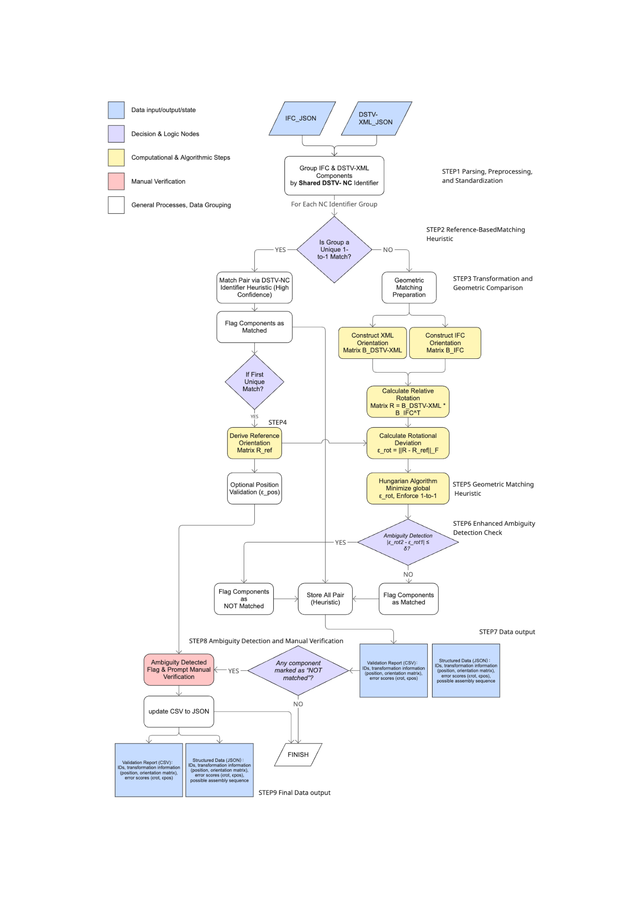

# Advancing Steel Structure Assembly Automation

**A standardized assembly description & NC-pivot matching framework**
*M.Sc. Thesis: “Advancing Steel Structure Assembly Automation: A Standardized Assembly Description for Enhanced Efficiency and Integration.”*

> **This repository summarizes the thesis and the method.**
> **Runnable code & datasets live here:** **➡️ [yelu-coding/gh\_ifc-xml\_matcher](https://github.com/yelu-coding/gh_ifc-xml_matcher)** 
## Table of Contents (Simplified)

* [Overview](#overview)
* [Data Model](#data-model)
* [Pipeline (actual scripts)](#pipeline-actual-scripts)
* [Algorithm Details (matches your code)](#algorithm-details-matches-your-code)
* [Artifacts (step outputs)](#artifacts-step-outputs)
* [Usage (exact commands with your scripts)](#usage-exact-commands-with-your-scripts)
* [Results & Survey](#results--survey)
* [Limits & Roadmap / License / Contact](#limits--roadmap--license--contact)
---

## Overview



Design (IFC) and fabrication (DSTV-XML/NC) live in **different stacks**; direct links are weak, so teams still fix IDs/axes **by hand**. In practice, **IFC and XML both reference the same NC filenames**—but IFC has **no standard field** for it (projects hide NC names in different properties).
We use the **NC file as a pivot**: start from **unique** NC groups to learn orientation, then resolve **duplicate** groups. Outputs are portable **JSON/CSV** (robot-ready) that plug into Grasshopper, planning, QA, or digital twins **without reformat**; less rework → less **waste & extra transport**.

---

## Data Model

Your scripts currently produce **raw structures** (not a unified schema). Step 3 consumes these raw structures directly.

### IFC (from `step1_ifc_parser.py` → `01_ifc.json`)

```jsonc
{
  "GlobalId": "…",
  "Type": "IfcBeam",
  "Properties": { "Pset_*": { "Key": "Value" } },
  "LocationRotation": {
    "Location": {"X": 1234.5, "Y": 67.8, "Z": 9.0},
    "Axis": [0.0,0.0,1.0],          // Z
    "RefDirection": [1.0,0.0,0.0]   // X
  }
}
```

### XML / WIA (from `step2_xml_parser.py` / `core/xml_parser.py` → `01_xml.json`)

```jsonc
{
  "ID": "P045",
  "Name": "…",
  "Type": "LEADING_PART",
  "Base": [1234.6, 67.7, 9.0],
  "Rx": [1,0,0],
  "Ry": [0,1,0],
  "Reference": ["PROJ_045.nc"]      // authoritative NC filename
}
```

> You also export `01_xml_install_order.json` (install sequence: Type→Z→X→Y).

---

## Pipeline (actual scripts)

**Step 1 — Parse (IFC + XML)**

* IFC：`step1_ifc_parser.py` → `outputs/step1_ifc/01_ifc.json`
* XML：`step2_xml_parser.py`（module path `core/xml_parser.py`） →
  `outputs/step2_xml/01_xml.json` + `outputs/step2_xml/01_xml_install_order.json`

**Step 2 — Group & Seed (handled inside Step 3)**

* From IFC `Properties[<prop_set>][<prop_key>]` read the **NC base name** (your code **appends “.nc”**), match against XML `Reference[0]`.
* **Unique 1↔1** NC groups → seed pairs.
* Use the **first** seed to compute a reference rotation `ref_mat`.

**Step 3 — Resolve duplicates & Export (handled inside Step 3)**

* For **duplicate-NC** groups: build a rotation-error cost matrix vs `ref_mat`, solve **one-to-one** with **Hungarian**, mark **ties** (≤1e-4) as `NeedManualCheck=true`.
* Export `match.json` + `match.csv`.

---

## Algorithm Details (matches your code)

File: `core/step3_match_id.py`

### 1) Read & preprocess

* Read raw IFC / XML JSON.
* IFC: `nc_name_raw = Properties[prop_set][prop_key]` → **`f"{raw}.nc"`** (be careful if `raw` already ends with `.nc`).
* XML: `nc_name = Reference[0]`.
* Group IFC & XML by NC name.

### 2) `compute_best_rotation_matrix(ifc_axis, ifc_refdir, xml_Rx, xml_Ry, ref_matrix=None)`

* Build `B_ifc=[X,Y,Z]` from **Z=Axis, X=RefDirection, Y=Z×X**;
  `B_xml=[X,Y,Z]` from **X=Rx, Y=Ry, Z=X×Y**; normalize.
* Exhaustive **sign flips** over (ifc Axis/RefDirection, xml Rx/Ry) ∈ {−1,+1}⁴.
* For each case: `R = B_xml @ B_ifc.T`; SVD → `R_final = U @ Vᵀ` (enforce `det=+1`).
* Error = Frobenius `|| (ref_matrix or I) − R_final ||_F`; keep the best.

### 3) Seeds & `ref_mat`

* For each **unique 1↔1** NC group: mark as `unique_nc_name` (error=0), collect one orientation pair.
* If any seed exists, compute `ref_mat` using the **first** pair via the routine above; otherwise `ref_mat = I`.

### 4) Duplicate groups: cost & assignment

* For each candidate pair `(i,j)` compute `(best_mat, err) = compute_best_rotation_matrix(..., ref_mat)`.
* Fill the **cost\_matrix** with `err`; `linear_sum_assignment` returns the pairing.
* **Tie flag**: if `err` is equal (within `threshold=1e-4`) to another value in the **same row** or **same column**, set `NeedManualCheck=true`.
* Record result:
  `IFC_ID, XML_ID, Error, Method("matrix_direction_match"), NC_Name, IFC_Location, IFC_Axis, IFC_RefDirection, XML_Base, XML_Rx, XML_Ry, NeedManualCheck`.

> **Note on `.nc` suffix**: if IFC already stores `something.nc`, the current concatenation yields `something.nc.nc` → mismatch. Prefer an IFC field **without** suffix for `prop_key`, or make concatenation conditional in code.

---

## Artifacts (step outputs)

Your Step 3 exporter writes both JSON and CSV (paths are passed in when calling):

* **JSON** (e.g., `outputs/step3_match/03_match.json`)

```jsonc
[
  {
    "IFC_ID": "…",
    "XML_ID": "…",
    "Error": 0.00012,
    "Method": "unique_nc_name" | "matrix_direction_match",
    "NC_Name": "PROJ_045.nc",
    "IFC_Location": [x,y,z],
    "IFC_Axis": [..], "IFC_RefDirection": [..],
    "XML_Base": [x,y,z],
    "XML_Rx": [..], "XML_Ry": [..],
    "NeedManualCheck": true
  }
]
```

* **CSV** (e.g., `outputs/step3_match/03_match.csv`) — same columns for filtering & audit.

---

## Usage (exact commands with your scripts)

> Your parsers currently use **hardcoded absolute paths** and pick “the first file in the folder.” For reproducibility, switch to **relative paths** as below.

### 1) IFC parse

```bash
# Edit step1_ifc_parser.py (bottom):
# input_ifc_folder = "./data/case1_ring_beam"
# output_ifc_json  = "./outputs/step1_ifc/01_ifc.json"

python step1_ifc_parser.py
```

### 2) XML parse (WIA)

```bash
# Edit step2_xml_parser.py (core/xml_parser.py) bottom:
# input_xml_folder        = "./data/case1_ring_beam"
# output_directory        = "./outputs/step2_xml"
# output_file_path        = "./outputs/step2_xml/01_xml.json"
# install_order_file_path = "./outputs/step2_xml/01_xml_install_order.json"

python step2_xml_parser.py
# or: python -m core.xml_parser
```

### 3) Match & export (group + seed + assign)

```bash
# File: core/step3_match_id.py
# Args: ifc_json_path  xml_json_path  out_json_path  out_csv_path  prop_set  prop_key

python - <<'PY'
from core.step3_match_id import match_and_export
match_and_export(
    ifc_json_path="./outputs/step1_ifc/01_ifc.json",
    xml_json_path="./outputs/step2_xml/01_xml.json",
    out_json_path="./outputs/step3_match/03_match.json",
    out_csv_path ="./outputs/step3_match/03_match.csv",
    prop_set="Pset_Custom",      # IFC Pset storing the NC base name
    prop_key ="NCFile"           # field inside that Pset (note: code appends ".nc")
)
PY
```

> 🔁 **Execution repo** with ready-to-run scripts & datasets:
> **[https://github.com/yelu-coding/gh\_ifc-xml\_matcher](https://github.com/yelu-coding/gh_ifc-xml_matcher)**

---

## Results & Survey

**Case 1 — Ring beam (9 parts).** Clean baseline, **100%** correct; a duplicate name resolved by geometry (not rules).

**Case 2 — Industrial (100+ parts).** Many duplicate-NC groups. Flow: **unique seeds → learn ref\_mat → propagate**; on the checked subset, **43 pairs** confirmed; **overall accuracy > 90%**; flagged pairs remained functionally correct after visual check.

**Case 3 — IFC2x3 vs IFC4 (common subset).**
The IFC4 file came from production and wasn’t a curated twin of IFC2x3, so I trimmed it to the **common subset** and matched both to the **same XML**. Two pairs ended up with **exactly the same match score**, so the algorithm had **two equally valid** assignments. Which one you get depends on the **input order** (the exports list parts differently). That’s why I now **label all equal-score cases as ambiguous**, so we do a quick confirmation instead of silently picking one of the two.


**Industry survey → actions.** Teams reported **manual/semi-manual linking** and **inconsistent NC storage** in IFC; demand for automated IFC–NC is strong.
We propose: IFC **`Pset_NC_Linkage.NC_FileName`** + unique NC naming **`PROJECTCODE_MARKNO.nc`**.

---

## Limits & Roadmap / License / Contact

**Limits.**

* `ref_matrix` currently learned from the **first** seed (not a global Procrustes over multiple seeds).
* `.nc` suffix handling depends on project; make it conditional or choose a suffix-less IFC field.
* Tie threshold fixed at `1e-4` (Frobenius); could be parameterized.

**Roadmap.**
Add secondary cues (pos offsets, hole/feature signatures, adjacency) or AI to **break ties**; formalize **assembly semantics** in IFC; broaden cross-tool validation; parallelization per NC group.


**License.** MIT
**Contact.** **Ye Lu** · RWTH Aachen — Construction & Robotics (2025). Issues → GitHub Issues; luye_momo@foxmail.com.


